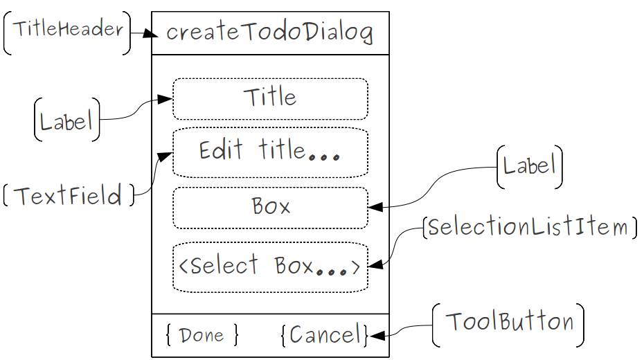
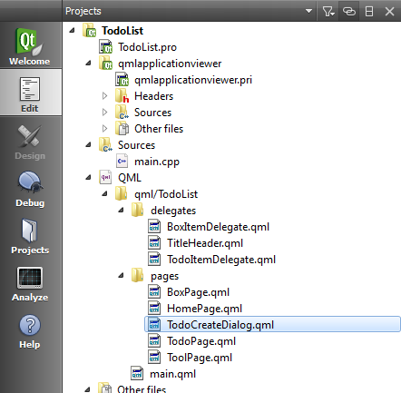
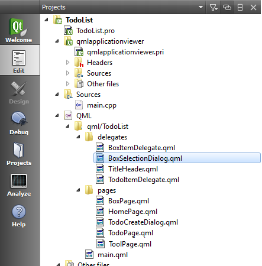
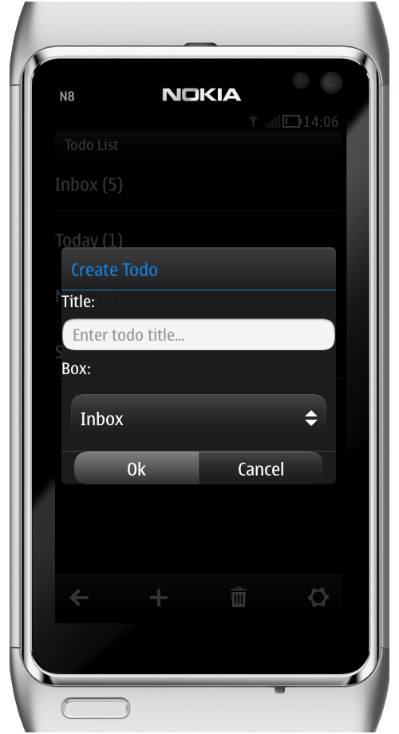

..
    ---------------------------------------------------------------------------
    Copyright (C) 2012 Digia Plc and/or its subsidiary(-ies).
    All rights reserved.
    This work, unless otherwise expressly stated, is licensed under a
    Creative Commons Attribution-ShareAlike 2.5.
    The full license document is available from
    http://creativecommons.org/licenses/by-sa/2.5/legalcode .
    ---------------------------------------------------------------------------

Using Dialogs to Create ToDo Items
==================================

At this stage, our application can read, display and update data using the database. To extend the application's functionality, we want to enable the users to add new items by using the QML :component:`Dialog <qml-dialog.html>` component, which provides a top-level window for short-term tasks and brief interaction with the user.

In order to create a new todo, we will provide a title for the todo and specify which of the four boxes it should belong to, and leave specifying other fields (e.g. the note) for later. The figure below presents a mockup of a UI form for our dialog:

To begin, let's define our dialog in a separate component file named `TodoCreateDialog.qml`:

The `TodoCreateDialog` implements a :component:`CommonDialog <qml-commondialog.html>` component, which inherits from :component:`Dialog <qml-dialog.html>` and provides a dialog with the platform-style title area so we can display a title for our dialog:

.. code-block:: js

    // TodoCreateDialog.qml

    import QtQuick 1.0
    import com.nokia.symbian 1.1

    CommonDialog {
        // id of the current box
        // Dialog title
        titleText: "Create Todo"

        property int boxId : 0
        // create alias to titleField.text to make it accessible
        // outside the component
        property alias todoTitle: titleField.text
        ...
    }

The `boxId` property will identify the box to which the todo should belong while the `todoTitle` alias enables us to later access the title text outside the component.

Since we want all our UI components to be placed horizontally, we hold them in one :qt:`Column <qml-column.html>` component:

.. code-block:: js

    // TodoCreateDialog.qml

    content: Column {
        spacing: 8
        anchors.left: parent.left
        anchors.right: parent.right
        ...
    }

Then we add the following components:

     `Label`: as a label to the title Field

.. code-block:: js

    // TodoCreateDialog.qml

    Label {
        id: titleLabel
        text:  "Title:"
        color: platformStyle.colorNormalLight
        font.pixelSize: platformStyle.fontSizeMedium
    }

     `TextField`: to enter the todo's title

.. code-block:: js

    // TodoCreateDialog.qml

    TextField{
        id: titleField
        placeholderText: "Enter todo title..."
        anchors{
            right: parent.right
            left: parent.left
        }
    }

     `Label`: as a label to the `Box` selection

.. code-block:: js

    // TodoCreateDialog.qml

    Label {
        id : boxLabel
        text:  "Box:"
        color: platformStyle.colorNormalLight
        font.pixelSize: platformStyle.fontSizeMedium
    }

     The :component:`SelectionItemList <qml-selectionlistitem.html>`: component, which provides a list of items, in our case boxes, and shows the current value:

.. code-block:: js

    // TodoCreateDialog.qml

    SelectionListItem {
        id: itemSelection
        anchors{
            right: parent.right; left: parent.left
        }
        title: selectionDialog.model.get(boxId).name
        // customize item list
        SelectionDialog {
            id: selectionDialog
            titleText: "Select Box"

            onAccepted :{
                // get the selected box name
                itemSelection.title = model.get(selectedIndex).name;
                // set the parent boxId property value
                // to the selected box id
                boxId = model.get(selectedIndex).boxId;
            }
        }
        // open selectionBox on the click signal
        onClicked: selectionDialog.open();
    }

Within our :component:`SelectionItemList <qml-selectionlistitem.html>` component, we used the `BoxSelectionDialog`, defined in a separate component file, which implements a :component:`SelectionDialog <qml-selectionlistitem.html>` that represents a list of choices to the user.

This enables us to customize the visual representation of the selectable items list by using a model that contains a list of available boxes:

.. code-block:: js

    // BoxSelectionDialog.qml

    SelectionDialog {
        id: root
        titleText: "Select a box"
        model: ListModel {
            ListElement { name: "Inbox"; boxId: 0}
            ListElement { name: "Today"; boxId: 1}
            ListElement { name: "Next";  boxId: 2}
            ListElement { name: "Later"; boxId: 3}
        }
        delegate: itemDelegate

        Component {
            id: itemDelegate

            MenuItem {
                text: model.name
                onClicked: {
                    selectedIndex = index;
                    root.accept();
                }
            }
        }
    }

The selected box will be displayed on the `SelectionListItem`, and its `boxId` assigned to the Dialog `BoxId`.

We should clear the `todoTitle` in the `TodoCreateDialog` every time the dialog is opened:

.. code-block:: js

    // TodoCreateDialog.qml

    onStatusChanged: {
        if(status == DialogStatus.Opening) {
            todoTitle = "";
        }
    }

Finally we add two buttons to confirm or cancel the creation of new items:

.. code-block:: js

    // TodoCreateDialog.qml

    buttons: ButtonRow {
        anchors {
            left: parent.left; right: parent.right
            margins: 16
        }

        Button {
            text: "Ok"
            onClicked: root.accept();
        }

        Button {
            text: "Cancel"
            onClicked: root.reject();
        }
    }

Update Home Page
----------------

The user has to be able to create new items on the home page so let's add a `TodoCreateDialog` component and reimplement its `onAccepted` signal handler. Once the action has been confirmed, we create an empty dictionary with todos fields, set the `box` and `title` fields with user's input values and insert the new item into the database.

.. code-block:: js

    // HomePage.qml

    TodoCreateDialog {
        id: todoCreateDialog

        onAccepted: {
            //check if the todoTitle is not empty
            if(todoTitle !== "") {
                // create a new empty dictionary
                var item = Core.defaultItem();
                // fill the box and title fields with the user input
                item.box = boxId;
                item.title = todoTitle;
                // create a Todo item into database
                Core.createTodo(item);
            }
        }
    }

The `defaultItem` function returns an empty dictionary with all necessary fields.

.. code-block:: js

    // core.js

    function defaultItem()
    {
        return {box: 0, done: false, title: "", note: "", modified: new Date()};
    }

The `createTodo` function, defined in `core.js`, inserts the new item into the database.

.. code-block:: js

    // core.js

    function createTodo(todoItem)
    {
        // create a read/write transaction
         _db.transaction( function(tx) {
            // execute the sql query to insert new item
            tx.executeSql(" \
                INSERT INTO todo (box, done, title, note, modified) \
                VALUES(?,?,?,?,?)",
                [ todoItem.box, todoItem.done, todoItem.title,
                todoItem.note, todoItem.modified ]);
        });
    }

Now that our `TodoCreateDialog` is ready for use, we add new :component:`ToolButton <qml-toolbutton.html>` that can open it:

.. code-block:: js

    // HomePage

    tools: ToolBarLayout {
        id: pageSpecificTools

        ToolButton {
            iconSource: "toolbar-back"
            onClicked:  Qt.quit();
        }

        ToolButton {
            iconSource: "toolbar-add"
            onClicked: todoCreateDialog.open();
        }
    }

.. Topic:: Exercise: Update Box Page

    You may also want to enable the user to create new items from the `box page` so that they will be added to the current selected box. The implementation would be quite similar to what we did when we updated the `home page`. You will, however, need to update the `box page` UI after adding a new item to be displayed on the list view. Please check the provided code related to this chapter and compare it to your implementation.

If we now run the code, our `TodoCreateDialog` will look like this:

.. rubric:: What's next?

In the next step, we'll be introducing the concept of `States` in QML and learn how to use them in order to make the todo's details editable.
