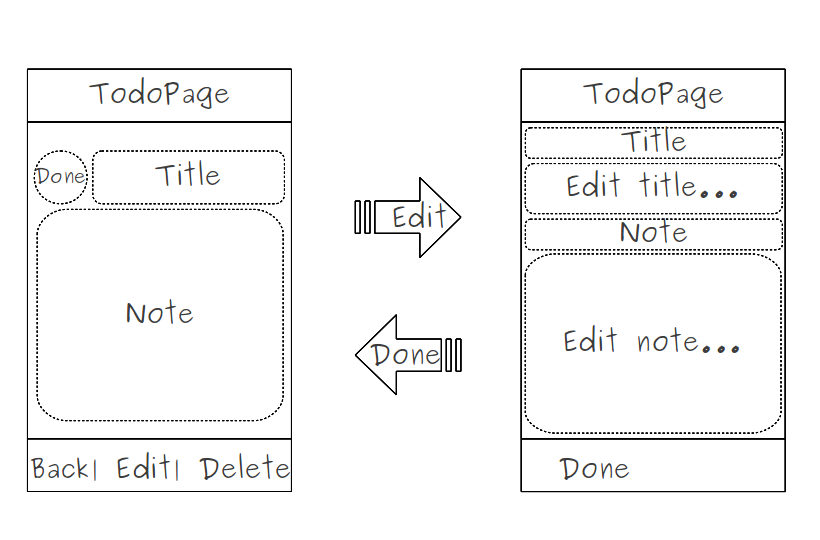

..
    ---------------------------------------------------------------------------
    Copyright (C) 2012 Digia Plc and/or its subsidiary(-ies).
    All rights reserved.
    This work, unless otherwise expressly stated, is licensed under a
    Creative Commons Attribution-ShareAlike 2.5.
    The full license document is available from
    http://creativecommons.org/licenses/by-sa/2.5/legalcode .
    ---------------------------------------------------------------------------

Using States to Make our ToDo Item Form Editable
================================================

Our application is getting more and more complete, right? But still, the user may need to edit the details of an existing     todo*, which is not yet possible. In this step, we'll provide the user with the ability to modify the todo's details using QML :qt:`States <qml-states.html>`.

The current `TodoPage` only enables the user to change the `done` state and displays details. To be able to edit the title and the note, we need to extend the `TodoPage` UI form. Let's use the mockup shown below for our UI:

.. image:: img/todopage-edit.png
    :scale: 65%
    :align: center

Since our `TodoPage` already contains a `TextField` for the title and a `TextArea` for the details, let's keep the same components for editing items and adding some `Text` labels to both `TitleField` and `Note` (as shown on the figure above). This brings us to the concept of using animations in states.

Each object in QML has a :qt:`State <qml-state.html>` element that defines a set of configurations. All items have a default state that defines the initial configuration of objects and property values. An object can have many states depending on how we want it to behave. In our case, we need to define the following states:

     A `details` (default) state to display the todo's details in a read-only mode with the ability to change the todo's `done` state via the `CheckBox`.
     An `edit` state for editing by changing the field's mode, adding new `Text` labels and hiding the `CheckBox` component.

For this, we need to define all necessary components. Note that the `details` state is the default state of the `TodoPage`.

     A `Label` for the `title` field. Let's make it so that it will only be visible when the `edit` state is the current state:

  .. code-block:: js

    // TodoPage.qml

    Label {
        id: titleLabel
        text: "Title:"
        color: platformStyle.colorNormalLight
        font.family: platformStyle.fontFamilyRegular
        anchors {
            top: header.bottom
            left: root.left
            right: root.right
            margins: 8
        }
    }

     A `CheckBox` to mark an item as *done* or not (only visible in `details` state):

  .. code-block:: js

    // TodoPage.qml

    CheckBox {
        id: doneField
        anchors {
            top: titleLabel.bottom
            left: root.left
        }
    }

     The `TextField` component to display and edit the item's title:

  .. code-block:: js

    // TodoPage.qml

    TextField {
        id: titleField
        // make it readOnly for the 'details' default state
        readOnly: true
        anchors {
            top: doneField.top;
            left: doneField.right; right: root.right
        }
    }

     A `Label` for the note field:

  .. code-block:: js

    // TodoPage.qml

    Label {
        id: noteLabel
        text: "Note:"
        color: platformStyle.colorNormalLight
        font.family: platformStyle.fontFamilyRegular
        anchors {
            top: doneField.bottom
            left: root.left; right: root.right
            margins: 8
        }
    }

     A `TextArea` to display and edit an item's note:

  .. code-block:: js

    // TodoPage.qml

    TextArea {
        id: noteField
        anchors {
            top: noteLabel.bottom; bottom: root.bottom
            left: root.left; right: root.right
        }
        // make it readOnly in the 'details' state
        readOnly: true
    }

     In the `ToolBarLayout` component, we define all the `ToolButtons` and `Buttons` we need for both states:

  .. code-block:: js

    // TodoPage.qml

    tools: ToolBarLayout {
        // go back to the previous page and update database
        ToolButton {
            iconSource: "toolbar-back"
            onClicked: {
                update();root.pageStack.pop();
            }
            // make it visible only when 'details' state is set
            visible: root.state == "details"
        }
        // two buttons two switch between states
        ButtonRow {
            exclusive: false
            // first button to switch to 'edit' state
            Button {
                id: editTool
                text: "Edit"
                onClicked: root.state = "edit";
            }
            // second button to go back to the 'details' state
            Button {
                id: doneTool
                text: "Done"
                onClicked: root.state = "details";
            }
        }
        // we add a new tool to delete an item
        ToolButton {
            id: deleteTool
            iconSource: "toolbar-delete"
            // delete the item on clicked signal
            onClicked: {
                deleteItem();
                root.pageStack.pop();
            }
        }
    }

Now that all UI components are defined, let's define our `States`. `States` in QML are a set of property configurations defined within a state element.

.. code-block:: js

    states: [
        State {
            name: "details"
            // Details State
        },
        State {
            name: "edit"
            // Edit State
        }
    ]

In the initial `details` state, we want to hide the `titleLabel` and `noteLabel` by setting their height and opacity values to null. The same for `doneTool`, which should only appear in the `edit` state to confirm the modifications.

.. code-block:: js

    // TodoPage.qml

    State {
        name: "details"
        PropertyChanges { target: titleLabel; height: 0; opacity: 0.0 }
        PropertyChanges { target: noteLabel;  height: 0; opacity: 0.0 }
        PropertyChanges { target: doneTool; visible: false }
    }

We don't want to display the `doneField` in the `details` state so let's set its width to null. We make `titleField` and `noteFiled` editable and only display the `doneTool` button on the ToolBarLayout.

.. code-block:: js

    // TodoPage.qml

    State {
        name: "edit"
        PropertyChanges { target: doneField;  width: 0 }
        PropertyChanges { target: noteField;  readOnly: false }
        PropertyChanges { target: titleField; readOnly: false }
        PropertyChanges { target: editTool;   visible: false }
        PropertyChanges { target: doneTool;   visible: true  }
        PropertyChanges { target: deleteTool; visible: false }
    }

On the `BoxPage.qml`, when we push the `TodoPage` to the pageStack we make the `details` state the default state:

.. code-block:: js

    // BoxPage.qml

    ListView {
        ...
        delegate: TodoItemDelegate{
            ...
            onClicked: {
                root.pageStack.push(window.todoPage,
                    {todoId: model.id, state:"details"});
            }
        ...
    }

.. note::

    If you set `details` as the default state using `state` property within `TodoPage.qml` the default height of our `Labels` will be set to 0, and won't appear in the `edit` state.

The `doneTool` ToolButton enables us to go back to the `details` state, but we only update in the database when we leave the `TodoPage` so we add an `update` function, which is called once the `toolbar-back` ButtonTool has been clicked, to update the item in the database:

.. code-block:: js

    // TodoPage.qml

    function update()
    {
      // read the TodoItem with the provided todoId
      var item = Core.readTodoItem(todoId);
      // get values from UI fields
      item.title = titleField.text;
      item.note = noteField.text;
      // new Data() will return the current date
      item.modified = new Date();
      // update the todoItem in Database
      Core.updateTodo(item);
    }

The `readTodoItem` and `updateTodo` functions were introduced in the previous step. To delete an item with the `toolbar-delete` ButtonTool, we add a `deleteItem` function:

.. code-block:: js

    // TodoPage.qml

    function deleteItem()
    {
        Core.deleteTodo(todoId);
    }

The `deleteItem` function will call the `deleteTodo` function in the `core.js` file, which in turn deletes the item with the given `todoId` from the database.

.. code-block:: js

    // core.js

    function deleteTodo(id)
    {
        // create a Read/Write transition
        _db.transaction( function(tx) {
            // execute sql query to delete item the given id.
            tx.executeSql("DELETE FROM todo WHERE id = ?", id);
        });
    }

The Transition Element
----------------------

QML provides a set of animation elements that interpolate property values in order to create smooth transitions. A :qt:`Transition <qml-transition.html>` element defines the animated transitions that occur in state changes. It defines a set of animations that smoothen the transitions to produce visually appealing state changes. In our case, the `TodoPage` has two states. When switching from the `details(default)` state to the `edit` state, the width and height of the `noteField` and `titleField` change. We want to add a transition to specify how the `width` and `height` properties should be animated using `NumberAnimation` when the `TodoPage` changes between the two states:

.. code-block:: js

    transitions: [
        Transition {
            // Changes to the width and height properties
            // should be animated, increasing the transition duration
            NumberAnimation {
                properties: "width,height"
                duration: 250
            }
        }

The `NumberAnimation` is a specialized `PropertyAnimation` that defines an animation to be applied when a numeric value changes. The screenshots below show the UI forms in both states when running the application:

.. image:: img/forms-state.
    :align: center
    :scale: 40%

.. rubric:: What's next?

Throughout the steps of this chapter, we have seen how to build an almost complete and functional application that:

     Manages and stores the todos in a database using the QML offline storage API
     Displays a list of data (boxes, todos) using `ListView` and `ListModel` QML elements
     Creates a new todo item using dialogs
     Edits an existing todo's details using states and transitions

In the next chapter, we'll guide you through some finishing touches to extend the existing functionality and we'll also introduce you to some tricks for making our application look more appealing.
