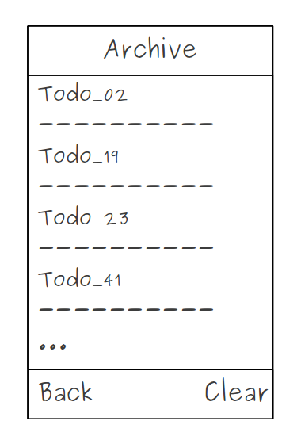
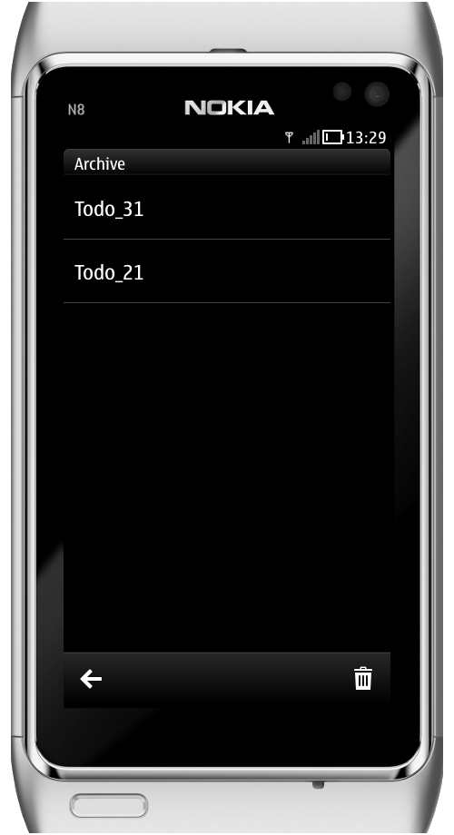

..
    ---------------------------------------------------------------------------
    Copyright (C) 2012 Digia Plc and/or its subsidiary(-ies).
    All rights reserved.
    This work, unless otherwise expressly stated, is licensed under a
    Creative Commons Attribution-ShareAlike 2.5.
    The full license document is available from
    http://creativecommons.org/licenses/by-sa/2.5/legalcode .
    ---------------------------------------------------------------------------

Use a Page to Manage Archived ToDo Items
========================================

Once a todo has been marked     done*, it shouldn't appear on the `BoxPage` to which it belongs. Instead, we want to have a new `ArchivePage` that contains a list of the *done* todos.

The `ArchivePage` should also provide actions to go back to the `HomePage` and clear the list. The following mockup provides a possible UI form for the `ArchivePage`:

Help
----

     You may want to create a new `ArchiveItemDelegate` to define a customized delegate which displays the todo's title

     Once the `ArchivePage` is activated, it must read all *done* todos (with `boxId` which equal *4*) using the `readTodoBox` function defined in `core.js`

     You need to declare a new `ToolButton` for the `HomePage` that opens the `ArchivePage`

     You need to declare a new `ToolButton` for the `BoxPage` that updates the `listView` and moves all *done* todos to the `ArchivePage`.

Here is a screenshot of the what the `ArchivePage` could look like:

.. rubric:: What's next?

In the next step, you will see how to add a counter indicator for each `Box` delegate to indicate how many items they contain.
