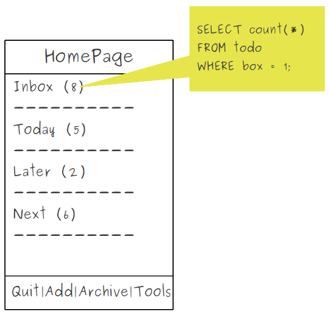
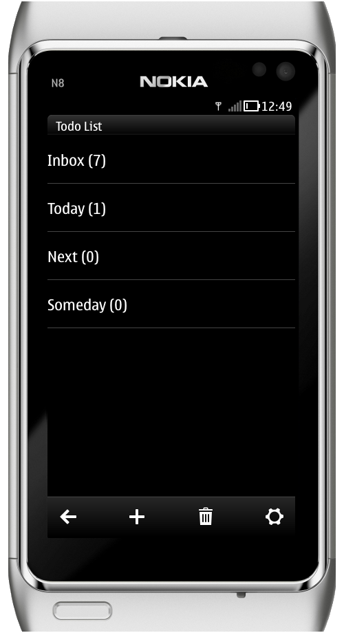

..
    ---------------------------------------------------------------------------
    Copyright (C) 2012 Digia Plc and/or its subsidiary(-ies).
    All rights reserved.
    This work, unless otherwise expressly stated, is licensed under a
    Creative Commons Attribution-ShareAlike 2.5.
    The full license document is available from
    http://creativecommons.org/licenses/by-sa/2.5/legalcode .
    ---------------------------------------------------------------------------

Counting ToDo Items in a Box from SQL
=====================================

This step will show you a trick for adding a counter that indicates how many items a box contains and displays it in the box delegate with the `Box` title as shown on the following mockup:

First, add an attribute to each `listElement`. It will be used later to display the right value on the delegate.

.. code-block:: js

    // HomePage.qml

    ListModel {
        id: boxModel
        // add counter attribute and initialize it to 0
        ListElement { name: "Inbox"; boxId: 0; count: 0 }
        ListElement { name: "Today"; boxId: 1; count: 0 }
        ListElement { name: "Later"; boxId: 2; count: 0 }
        ListElement { name: "Next";  boxId: 3; count: 0 }
    }

To display the `count` value with the box title, concatenate both values in the delegate's title:

.. code-block:: js

    // HomePage.qml

    ListView {
        ...
        delegate: BoxItemDelegate {
            title: model.name +" (" + model.count +")"
            ...
        }
    }

Add an `updateUi` function that updates the value of `counter` on `boxModel`:

.. code-block:: js

    // HomePage.qml

    function updateUi()
    {
        for (var i=0; i< boxModel.count; i++)
        {
            var boxId= boxModel.get(i).boxId;
            boxModel.set(i, { count: Core.countBox(boxId) });
        }
    }

The `countBox` function is defined in the `core.js` file and reads the number of items a box contains in the database:

.. code-block:: js

    // Core.js

    function countBox(boxId)
    {
        //declare a variable to store the result
        var data = 0;
        // create a ReadOnly transaction
        _db.readTransaction( function(tx) {
            // execute sql statement
            // to read number of items belonging to the box with given boxId
            var rs = tx.executeSql("SELECT count(    ) \
                FROM todo \
                WHERE box = ?",
                [boxId]);
            // check and set the result to data variable
            if(rs.rows.length === 1) {
                data = rs.rows.item(0)["count(    )"];
            }
        });
        return data;
    }

The `updateUi` function should be called every time the `HomePage` is activated:

.. code-block:: js

    // HomePage.qml

    onStatusChanged: {
        if (status == PageStatus.Activating) {
            updateUi();
        }
    }

That's it! Here is our home page's new and improved look:

.. rubric:: What's next?

Next, you will be asked to enable the user to move a todo from a box to another.

