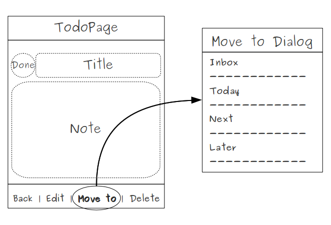
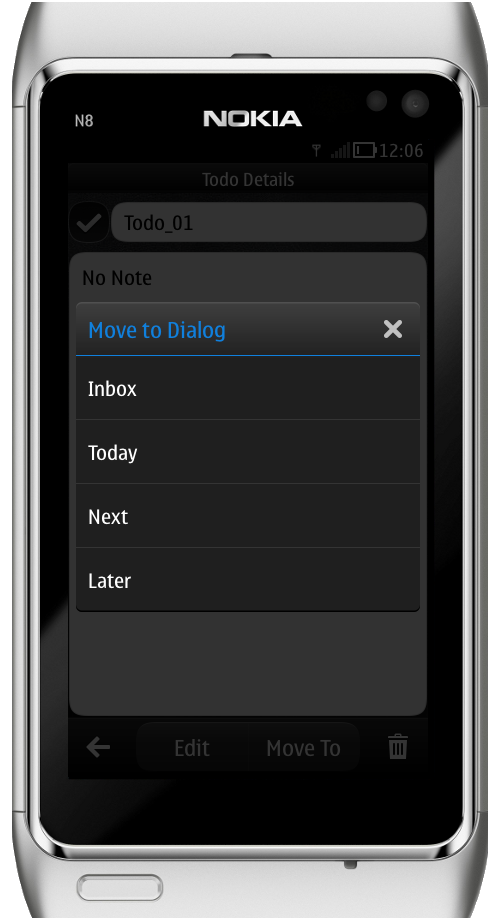

..
    ---------------------------------------------------------------------------
    Copyright (C) 2012 Digia Plc and/or its subsidiary(-ies).
    All rights reserved.
    This work, unless otherwise expressly stated, is licensed under a
    Creative Commons Attribution-ShareAlike 2.5.
    The full license document is available from
    http://creativecommons.org/licenses/by-sa/2.5/legalcode .
    ---------------------------------------------------------------------------

Moving ToDo Items to a Box
==========================

In order to make our application more flexible, provide the user with the ability to move a todo from one box to another by declaring a new `ToolButton` on the `TodoPage` that opens a suitable dialog. The dialog should contain a selection of available boxes so the user can choose where to move the todo.

Help
----

     The `MoveTo` ToolButton should open a dialog that includes a selection of all boxes (please refer to the step: Using Dialogs to Create ToDo Items)

     Use `MoveToDialig` to define a customized list of our boxes

     Reimplement the `MoveToDialog's` `onAccepted` signal handler by updating the `boxId` field of the todo that has been moved

     Change the visibility of the `MoveTo` ToolButton in the `edit` state to make it only visible in the detail page state

This is a screenshot of our `MoveTo` dialog:

.. rubric:: What's next?

In the next step we will show you some tricks for enhancing the look and feel features by adding a splash when the application is loading.
