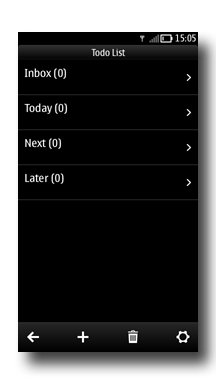

..
    ---------------------------------------------------------------------------
    Copyright (C) 2012 Digia Plc and/or its subsidiary(-ies).
    All rights reserved.
    This work, unless otherwise expressly stated, is licensed under a
    Creative Commons Attribution-ShareAlike 2.5.
    The full license document is available from
    http://creativecommons.org/licenses/by-sa/2.5/legalcode .
    ---------------------------------------------------------------------------

Splash Screen
=============

In this step, we'll go over the use of background and splash screens to enhance the look and feel of the application.

Background
----------

To add a background to the application, you need to add an :qt:`Image <qml-image.html>` element on the main window:

.. code-block:: js

    // main.qml

    Window {
        ...
        Image {
            source:"images/background.jpg"
        }
        ...
    }

Splash Screen
-------------

On the application startup, we want to display an image while the `HomePage` is being loaded. One trick for making our application look smooth is to use a screenshot of `HomePage` as the default splash screen with a text message telling the user that the application is loading:

We will then need to declare a :qt:`QSplashScreen <qsplashscreen.html>` object in `main.cpp`:

.. code-block:: js

    // main.cpp

    int main(int argc, char     argv[])
    {
        ...
        QSplashScreen splash(
            QPixmap(":images/splash.png"),
            Qt::WindowStaysOnTopHint);
        ...
    }

The `splash` object will display the splash screen with a small message:

.. code-block:: cpp

    //main.cpp

    splash.show();
    splash.showMessage(
        "Loading Database...",
        Qt::AlignHCenter,
        Qt::white);

Then we process all the pending events in order to create a `QmlApplicationViewer` object and set `main.qml` as the main qml file:

.. code-block:: cpp

    app.processEvents();
    QmlApplicationViewer viewer;
    viewer.setMainQmlFile(QLatin1String("qml/TodoList/main.qml"));
    viewer.showExpanded();

Once the `viewer` is loaded, we close the splash and display the `main.qml` file content:

.. code-block:: cpp

    // main.cpp
    ...
    app.processEvents();
    splash.finish(&viewer);
    return app.exec();
  }

.. rubric:: What's next?

By following the steps of this chapter, you have learned some tricks for making the application look better and have tested your QML knowledge by participating in the code implementation.

In the next chapter, we'll learn how to port our `TodoList` application on Nokia N9 using MeeGo/Harmattan Components.
