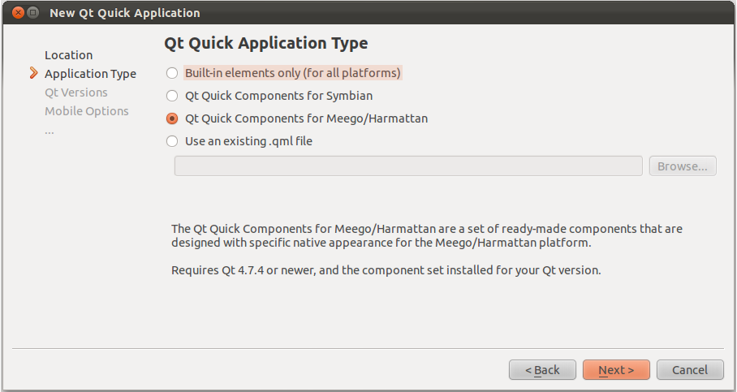
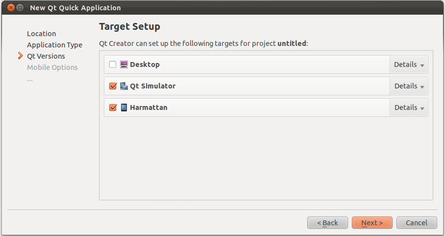
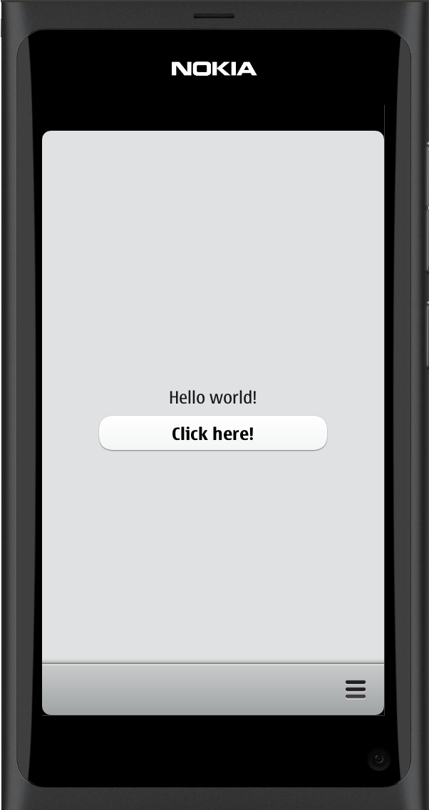

..
    ---------------------------------------------------------------------------
    Copyright (C) 2012 Digia Plc and/or its subsidiary(-ies).
    All rights reserved.
    This work, unless otherwise expressly stated, is licensed under a
    Creative Commons Attribution-ShareAlike 2.5.
    The full license document is available from
    http://creativecommons.org/licenses/by-sa/2.5/legalcode .
    ---------------------------------------------------------------------------

Setting Up Your Environment
===========================

Before we start, you need to get and install the MeeGo/Harmattan Components using Qt SDK.

.. note::

    Since MeeGo is a Linux-based software platform, we will be using Qt Creator under Linux to build and deploy our application. This is just a personal preference which doesn't really matter for the porting so feel free to use your preferred OS.

Inside Qt Creator IDE open `StartUp -> Update Components`. This will start the SDK Maintenance tool. Inside the tool ensure that `MeeGo/Harmattan Components` are selected and installed.

To ensure that the components are correctly installed, create a new `Qt Quick Application` using MeeGo/Harmattan Components:

You can select Harmattan and Qt Simulator as your targets (if you want to test your application before deploying it on the Device).

Qt Creator will generate a skeleton code for you that displays a page with some UI elements as follows:

Inspecting the Code
-------------------

If you take a look at the generated code, you'll find two QML files (`main.qml` and `MainPage.qml`) in the declarative part, which is quite similar to what we have seen in the :ref:`inspecting-generated-code` section when running a simple Symbian^3 example.

The `main.qml` is a `PageStackWindow <http://doc.qt.nokia.com/qtquick-components-symbian-1.1/qml-pagestackwindow.html>`_ component, which is derived from the :component:`Window <qml-window.html>` component. It contains a default :component:`PageStack <qml-pagestack.html>`, which we will use later to push and pop our pages from. Additionally, it provides a statusbar, a toolbar and the platform's common look and feel.

The `MainPage` is set as the initial page of the `pageStack` using the `initialPage` property. The `PageStackWindow` contains a :component:`ToolBarLayout <qml-toolbarlayout.html>` with a `ToolIcon <http://harmattan-dev.nokia.com/docs/library/html/qt-components/qt-components-meego-toolicon.html?tab=1>`_ that opens a `Menu <http://harmattan-dev.nokia.com/docs/library/html/qt-components/qt-components-meego-menu.html?tab=1>`_. We will cover the use of `Menu` in the next step.

.. code-block:: js

    // main.cpp

    import QtQuick 1.1
    import com.nokia.meego 1.0

    PageStackWindow {
        id: appWindow

        initialPage: mainPage

        MainPage {
            id: mainPage
        }

        ToolBarLayout {
            id: commonTools
            visible: true
            ToolIcon {
                platformIconId: "toolbar-view-menu"
                anchors.right: (parent === undefined) ? undefined :
                                                            parent.right
                onClicked:
                (myMenu.status == DialogStatus.Closed) ? myMenu.open() :
                                                            myMenu.close()
            }
        }

        Menu {
            id: myMenu
            visualParent: pageStack
            MenuLayout {
                MenuItem { text: qsTr("Sample menu item") }
            }
        }
    }

The `MainPage` consists of a simple `Page` component with a centered `Button` and displays a `Hello world!` text once the button is being clicked.

.. code-block:: js

    import QtQuick 1.1
    import com.nokia.meego 1.0

    Page {
        tools: commonTools

        Label {
            id: label
            anchors.centerIn: parent
            text: qsTr("Hello world!")
            visible: false
        }

        Button{
            anchors {
                horizontalCenter: parent.horizontalCenter
                top: label.bottom
                topMargin: 10
            }
            text: qsTr("Click here!")
            onClicked: label.visible = true
        }
    }

The code is quite similar to the basic Symbian^3 `Hello world!` example we have seen in the second chapter of this guide.

.. rubric:: What's next?

Now let's go through the source code and get our `TodoList` inside. We will do this by exploring the source code of our `TodoList` application and the main changes required.
