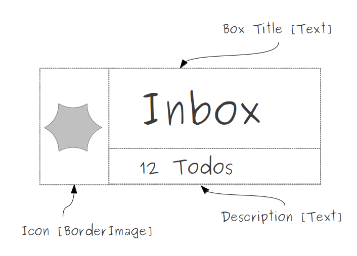
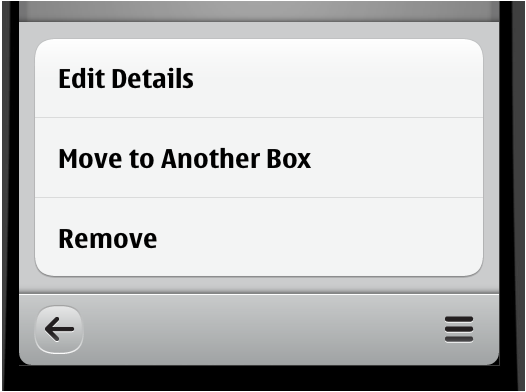
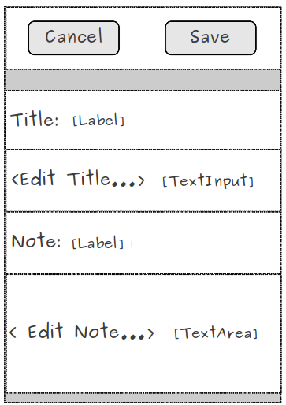
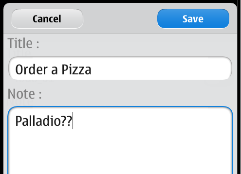

..
    ---------------------------------------------------------------------------
    Copyright (C) 2012 Digia Plc and/or its subsidiary(-ies).
    All rights reserved.
    This work, unless otherwise expressly stated, is licensed under a
    Creative Commons Attribution-ShareAlike 2.5.
    The full license document is available from
    http://creativecommons.org/licenses/by-sa/2.5/legalcode .
    ---------------------------------------------------------------------------

Main Changes
============

In this step, we'll take a look at the main changes required to port our `TodoList` application to the MeeGo/Harmattan platform. Additionally, we'll introduce a couple of new UI elements to make our application conform with the MeeGo look and feel.

We will skip the details because the majority of our UI and logic code will remain the same. If you have followed the previous chapters attentively, you should be able to understand the changes by simply going through the source code. A proper diff tool will ease the comparison of the code.

Comparing the source code
-------------------------

Let's take a look at the current file structure of the different application versions.

The following figure provides an overview of the implementation to Symbian^3 as well as MeeGo/Harmattan:

.. image:: img/compare.
    :scale: 100%
    :align: center

The list below describes the main changes to the files above:

.. list-table::
    :widths: 10 30
    :header-rows: 1

           - Location
        - Description
           - **C++ code**
        - Not compared (As it's generated by Qt Creator)
           - **Delegates**
        -
           - `ArchiveItemDelegate.qml`
        - Implementing a new delegate component based on the `Item` component (`ListItem` is not supported)
           - `BoxItemDelegate.qml`
        - Implementing a new delegate component based on the `Item` component (`ListItem` is not supported) with animation when it's clicked
           - `TitleHeader.qml`
        - Implementing a new header component based on the `Rectangle` component (`ListHeading` is not supported)
           - `TodoItemDelegate.qml`
        - Implementing a new delegate component based on the `Item` component(`ListItem` is not Supported) with animation when it's clicked
           - **Pages**
        -
           - `ArchivePage.qml`
        - Using `ToolIcon` instead of `ToolButton`
           - `BoxPage.qml`
        - Using `ToolIcons` instead of `ToolButton`
           - `HomePage.qml`
        - Using `ToolIcons` and a menu to display tool actions
           - `TodoPage.qml`
        -        Displaying details on `readOnly` mode
                 Using `ToolIcons`
                 Using a menu containing actions to edit, delete or move the todo to another box
                 Editing todos details using a sheet (`EditSheet.qml`)
                 Using a `Switch <http://harmattan-dev.nokia.com/docs/library/html/qt-components/qt-components-meego-switch.html?tab=1>`_ component instead of `CheckBox`  (just for fun!)
           - `BoxSelectionDialog.qml`
        - Not specifying any delegate
           - `TodoCreateDialog.qml`
        - Using :component:`QueryDialog <qml-querydialog.hml>` (`CommonDialog` not supported)
           - `ToolPage.qml`
        - Using `ToolMenu.qml` instead, that implements a menu with the same actions
           - **JavaScript**
        -
           - `core.js`
        - No main changes
           - `UIConstants.qml`
        - MeeGo look and feel features

In order to make our `TodoList` application conform with the N9 look and feel, we will use a couple of new UI elements such as menus, tool icons and sheets and reimplement the delegates in the list views to be supported when using MeeGo Harmattan Components.

Reimplementing List View Delegates
----------------------------------

Previously, while using Symbian^3 components to define a list view, we started by defining a model, a delegate and a header. We keep the same approach here.

Unlike Symbian^3 components, MeeGo/Harmattan Components don't provide a `ListItem` component so we need to implement our own delegate to define how we want data to be displayed into the list view.

For instance, in the home page, we want display the title of each box, a small description that mentions how many todos a box contains and a small icon on the left.

This is what our delegate component would look like:

The `BoxItemDelegate` implements an `Item` component that contains the UI elements in the figure above with a `mouseArea` that enables simple mouse handling. In particular, we want to emit a clicked signal once the delegate has been clicked. We also provide property aliases so that we can edit the `Text` and `Icon` items outside the component as we have already seen in the previous chapters.

.. code-block:: js

    // BoxItemDelegate.qml

    import QtQuick 1.0
    import com.nokia.meego 1.0
    ...
    Item {
        id: root

        property alias text: textField.text
        property alias iconSource: icon.source
        property alias description: descriptionField.text

        // Signal emitted when the delegate is being clicked
        signal clicked
        ...
        Row {
            ...
            // a BorderImage to display an icon
            BorderImage {
                id: icon
                ...
            }
            // We want title and description to be positioned vertically
            Column {
                ...
                // a Text to display the box title
                Text {
                    id: textField
                    ...
                }
                // a Text element for displaying how many items a box contains
                Text {
                    id: descriptionField
                    ...
                }
            }
        }
        // mouse handling
        MouseArea {
            anchors.fill: parent
            onClicked: {
                // emit clicked signal onClicked
                root.clicked();
                ...
            }
        }
        ...
    }

The screenshot below shows what our `BoxItemDelegate` will look like:

The same way, for the box page list, we have defined the `TodoItemDelagate` that implements an `Item` which displays the todo title, a small description, and a check box to mark the todo as done. For more details, please take a look at the `TodoItemDelegate.qml` file.

Using ToolBarLayout with ToolIcons
----------------------------------

In the `ToolBarLayout` of our pages, we were using `ToolButton` when implementing the Symbian^3 version of our application. In MeeGo, it's more convenient to use the `ToolIcon <http://harmattan-dev.nokia.com/docs/library/html/qt-components/qt-components-meego-toolicon.html?tab=1>`_ component, which defines a button-like component showing an icon using the `iconId` property. You can find more details on how to use `ToolIcons` in the article `MeeGo Harmattan QML ToolIcon Element and Various icons <http://www.developer.nokia.com/Community/Wiki/MeeGo_Harmattan_QML_ToolIcon_Element_and_Various_icons>`_.

For instance, in the home page, we have defined three instances of the `ToolIcon` component: one to create a new todo, another to open the archive page and the third to open a menu for testing purposes.

.. code-block:: js

    //HomePage

    tools: ToolBarLayout {

        ToolIcon{
            iconId: "icon-m-toolbar-add";
            onClicked: todoCreateDialog.open();
        }

        ToolIcon {
            iconId: "icon-m-toolbar-delete"
            onClicked: root.pageStack.push(Qt.resolvedUrl("ArchivePage.qml"));
        }

        ToolIcon {
            iconId: "icon-m-toolbar-settings";
            onClicked: toolMenu.open();
        }
    }

The screenshot below shows what our `ToolIcons` will look like on N9:

Providing Tool Actions Using Menu
---------------------------------

To implement tool actions, we will use the `Menu <http://harmattan-dev.nokia.com/docs/library/html/qt-components/qt-components-meego-menu.html?tab=1>`_ component which provides a list of `MenuItems <http://harmattan-dev.nokia.com/docs/library/html/qt-components/qt-components-meego-menuitem.html?tab=1>`_ that the user can choose from. Each menu item can be associated with an action to be performed when the item is clicked. The `Menu` is hidden by default and can be opened in response to a user action.

In our todo page, the `ToolbarLayout` contains two `ToolIcons`: the first one updates and moves back to the box page and the second opens a menu that lists a couple of actions for the user.

.. code-block:: js

    // TodoPage.qml

    tools: ToolBarLayout {

        ToolIcon { iconId: "icon-m-toolbar-back";
                    onClicked:{update();root.pageStack.pop()}}

        ToolIcon { iconId: "icon-m-toolbar-view-menu";
                    //Open the todoMenu when the TooIcon is clicked
                    onClicked: todoMenu.open()}
    }

The `todoMenu` contains three actions: the first edits the todo's details via a sheet, the second moves the todo to another box and the third action removes the current todo.

.. code-block:: js

    // TodoPage.qml

    Menu {
        id: todoMenu
        // visualParent is needed to specify the grayed out area
        visualParent: pageStack
        MenuLayout {
            MenuItem {text: "Edit Details"; onClicked: root.performAction(0) }
            MenuItem {text: "Move to Another Box"; onClicked: root.performAction(1)}
            MenuItem {text: "Remove"; onClicked: root.performAction(2)}
        }

    }

The `performAction` function enables us to execute the right action depending on the id provided when clicking on one of the `MenuItems`.

.. code-block:: js

    function performAction(actionId)
    {
        switch(actionId)
        {
        case 0:
            // Open a sheet to edit the details
            editSheet.open();
            break;
        case 1:
            // Open a dialog to select where to move the todo
            moveToDialog.open();
            break;
        case 2:
            // delete the todo and move back to the box page
            deleteItem();
            root.pageStack.pop();
            break;
        default:
            break;
        }
    }

And here is what our menu will look like :

We also used a `ToolMenu` instead of a `ToolPage` to provide a menu with an action list to reset and add random todos from the home page. For details, please take a look at the `ToolMenu.qml` file.

Editing Todo Details Using Sheet
--------------------------------

We also use `Sheet <http://harmattan-dev.nokia.com/docs/library/html/qt-components/qt-components-meego-sheet.html?tab=1>`_ component to edit our todos details. A `Sheet` is a dialog container which is the most used component to edit and update details in N9 apps. In most cases, it is a fullscreen dialog that slides up from the bottom when activated with the `accept` and `reject` buttons rendered at the top of content field.

In our case, we used a `Sheet` component to edit a todo's details (title and note fields). Our sheet will contain the UI elements shown in the figure below:

The `EditSheet` implements a `Sheet` component which contains the elements in the figure above. We added two property aliases to the `TextField's` texts in order to update their values from outside the component.

.. code-block:: js

    // EditSheet.qml

    import QtQuick 1.0
    import com.nokia.meego 1.0
    ...
    Sheet {
        id: root

        property alias titleText: titleField.text
        property alias noteText: noteField.text

        // rename the button as 'save' and 'cancel'
        acceptButtonText: "Save"
        rejectButtonText: "Cancel"
        ...
        content: Item {
            anchors.fill: parent
            // Label for the title field
            Label {
                id: title
                text: "Title :"
                anchors {
                    top: acceptButtonText.top
                    right: parent.right
                    left: parent.left
                    margins: 8
                }
                ...
            }
            // TextArea for the title
            TextField {
                id: titleField
                anchors {
                    top: title.bottom
                    right: parent.right
                    left: parent.left
                    margins: 8
                }
                ...
            }
            // Label for the note field
            Label {
                id: note
                text: "Note :"
                anchors {
                    top: titleField.bottom
                    right: parent.right
                    left: parent.left
                    margins: 8
                }
                ...
            }
            // TextArea for the note
            TextArea {
                id: noteField
                anchors {
                    top: note.bottom
                    right: parent.right
                    left: parent.left
                    bottom: parent.bottom
                    margins: 8
                }
                ...
            }
        }
    }

In the `TodoPage`, we declare an `EditPage` and handle `accepted` and `rejected` signals:

.. code-block:: js

    // TodoPage.qml

    EditSheet
    {
        id: editSheet
        titleText: titleField.text
        noteText: noteField.text

        onAccepted: {
            // update the title and the note text
            titleField.text = titleText;
            noteField.text = noteText;
        }

        onRejected: {
            // reset the values on the sheet fields
            titleText = titleField.text;
            noteText = noteField.text;
        }
    }

The following screenshot shows what our `sheet` looks like:

Deploy the Application on N9
----------------------------

If you are lucky enough to have an N9 to deploy the TodoList application onto, please refer to the `Connecting MeeGo Harmattan Devices <http://doc.qt.nokia.com/qtcreator-2.3/creator-developing-meego.html>`_ article that describes the steps necessary to deploy the application.

For more details about MeeGo Harmattan Components, please refer to the `MeeGo 1.2 Harmattan API Documentation pages <http://harmattan-dev.nokia.com/docs/library/html/main.html>`_.

We hope that this has shown a large similarity between the development with Qt Quick Components for Symbian^3 and MeeGo Harmattan and will motivate you to port your application to N9 or even keep both platform supported in parallel.
